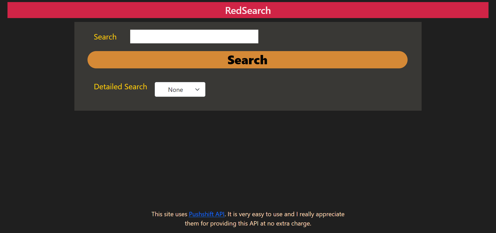

RedSearch

I have created a website where user has access to almost every filter that one needs while searching for something on reddit. In this project, I used [Pushshift API](https://github.com/pushshift/api). The pushshift.io Reddit API was designed and created by the /r/datasets mod team to help provide enhanced functionality and search capabilities for searching Reddit comments and submissions.

## Table of contents

- [Overview](#overview)
  - [Screenshot](#screenshot)
  - [Links](#links)
- [My process](#my-process)
  - [Built with](#built-with)
  
**Note: Delete this note and update the table of contents based on what sections you keep.**

## Overview
One can easiy search on reddit with this app with proper filters. I have disabled adult content so that user will not feel uncomfortable while using this website at work locations. I have tried to make it as user-friendly as possible. Also, I have tried to provide every possible filter to this web app. 

This app contains 3 options:
1. None: No filter is selected -> This option displays posts only in the descending order of creation date
2. Submission: This option displays posts with the selected filters only.
3. Comment: This option comments posts with the selected filters only.

By default, each request shows 25 posts.

### Screenshot

#### 1. Landing Page

 

#### 2. Default Search Result: 25 result per query

 
 
#### 3. Form for Search only submissions

 

#### 4. Submission Search Result

 

#### 5. Form for Search only comments

 

#### 6. Comment Search Result

### Links

- Live URL: [https://tarunsahnan.github.io/RedSearch/](https://tarunsahnan.github.io/RedSearch/)

## My process

I would like to explain my process is steps so that you can easily understand it:

Step 1: Read API documentation. So, that you can get how and where to start your project.
Step 2:Create HTML File
Step 3: Use Bootstrap and CSS according to your choice
Step 4: Add basic javascript.
Step 5: Now again read documentation and complete the project.

### Built with

- [HTML5](https://en.wikipedia.org/wiki/HTML5)
- [CSS](https://developer.mozilla.org/en-US/docs/Web/CSS)
- [Bootstrap](https://getbootstrap.com/)
- [Javascript](https://www.javascript.com/)
- [FlexBox](https://developer.mozilla.org/en-US/docs/Web/CSS)
- [Grid](https://developer.mozilla.org/en-US/docs/Web/CSS/CSS_Grid_Layout)
- [Font Awsome](https://fontawesome.com/)

Thank you for visitng my repository. Feel free to contact if any issue is found. 